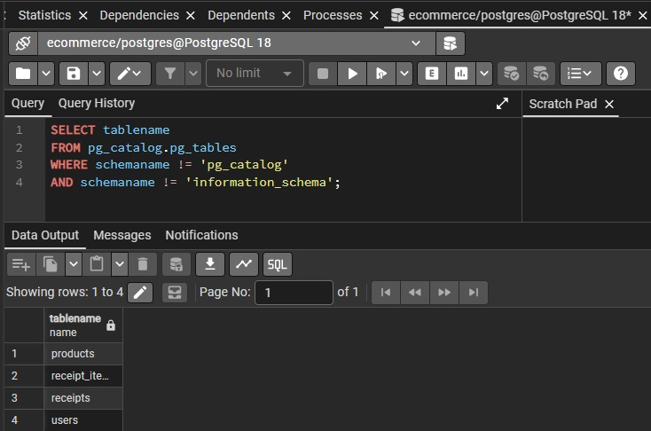
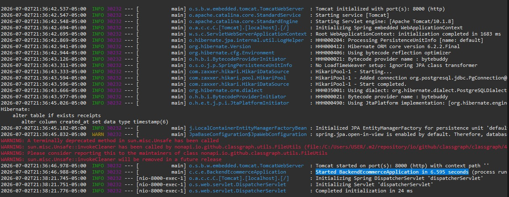
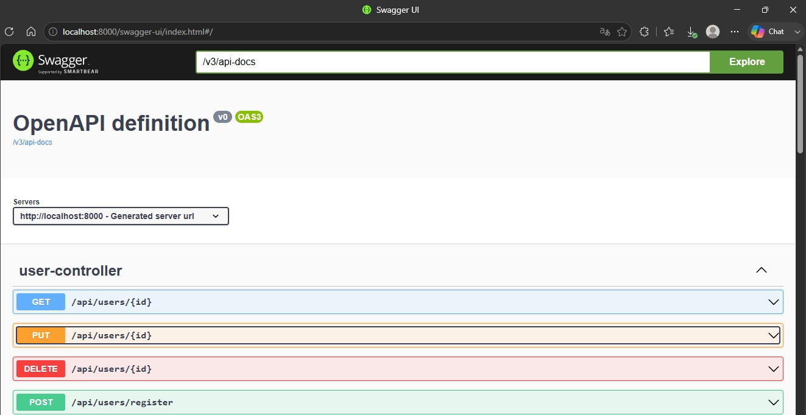
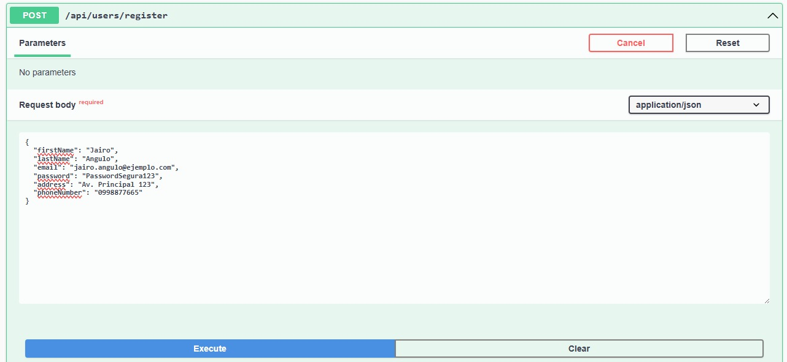
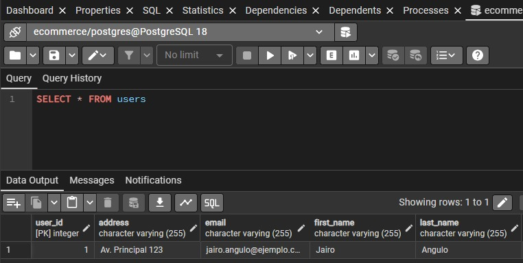

# BackEnd-SpringBoot — API REST de E-commerce

- Jairo Angulo  
[Repositorio en GitHub](https://github.com/Andres-JA/BackEnd-SpringBoot.git)

API REST para un sistema básico de e-commerce construida con **Spring Boot 3.1.0**, **Maven** y **PostgreSQL**.

## Tecnologías

- Java 17
- Spring Boot 3.1.0 (Web, Data JPA, Validation)
- Spring Security Crypto (BCrypt)
- PostgreSQL
- Lombok
- SpringDoc OpenAPI / Swagger UI


## Endpoints

### Usuarios (`/api/users`)

| Método | Ruta               | Descripción               |
|--------|--------------------|---------------------------|
| POST   | `/api/users/register` | Registrar nuevo usuario   |
| POST   | `/api/users/login`    | Iniciar sesión            |
| GET    | `/api/users/{id}`     | Obtener usuario por ID    |
| PUT    | `/api/users/{id}`     | Actualizar usuario        |
| DELETE | `/api/users/{id}`     | Eliminar usuario          |

### Productos (`/api/products`)

| Método | Ruta                  | Descripción               |
|--------|------------------------|---------------------------|
| POST   | `/api/products`        | Crear producto            |
| GET    | `/api/products/{id}`   | Obtener producto por ID   |
| GET    | `/api/products`        | Listar todos los productos|
| PUT    | `/api/products/{id}`   | Actualizar producto       |
| DELETE | `/api/products/{id}`   | Eliminar producto         |

### Recibos (`/api/receipts`)

| Método | Ruta                   | Descripción                     |
|--------|-------------------------|---------------------------------|
| POST   | `/api/receipts`         | Crear recibo (calcula total)    |
| GET    | `/api/receipts/{id}`    | Obtener recibo por ID           |
| GET    | `/api/receipts`         | Listar todos los recibos        |
| GET    | `/api/receipts/user/{userId}` | Recibos de un usuario      |
| DELETE | `/api/receipts/{id}`    | Eliminar recibo                 |

## Ejecución

1. Crear base de datos PostgreSQL llamada `ecommerce`.
2. Configurar credenciales en `application.properties` o variables de entorno (`DB_URL`, `DB_USER`, `DB_PASSWORD`).
3. Ejecutar:

```bash
mvn clean spring-boot:run
```

La API corre en `http://localhost:8000`. Swagger disponible en `/swagger-ui.html`.

## Características principales

- Contraseñas encriptadas con BCrypt (nunca se devuelven en respuestas)
- Precios y totales con `BigDecimal` para precisión monetaria
- Cálculo del total de recibos desde la base de datos (no desde el frontend)
- Descuento automático de stock al crear un recibo
- Manejo global de errores con `@RestControllerAdvice`
- Validación de datos de entrada con `jakarta.validation`
- DTOs separados de las entidades JPA
- Arquitectura por capas: controlador → servicio → repositorio

## Evidencias

### 1. Tablas creadas en PostgreSQL

Tablas `users`, `products`, `receipts` y `receipt_items` generadas automáticamente por JPA desde las entidades del proyecto.



### 2. Ejecución exitosa en consola

Aplicación Spring Boot corriendo correctamente en el puerto 8000 desde Spring Tools.



### 3. Swagger UI — Documentación de endpoints

Interfaz de Swagger con todos los endpoints disponibles: GET, POST, PUT, DELETE para probar la API.



### 4. Envío de datos desde Swagger a la base de datos

Ejemplo de petición POST con parámetros enviados desde Swagger para crear un registro en la base de datos.



### 5. Verificación en PostgreSQL

Consulta en PostgreSQL confirmando que los datos se almacenaron correctamente en la base de datos.



## Estructura del proyecto

```
src/main/java/com/coltis/ecommerce
|
|-- BackEndEcommerceApplication.java
|
|-- config
|   |-- PasswordConfig.java
|
|-- controllers
|   |-- ProductController.java
|   |-- ReceiptController.java
|   |-- UserController.java
|
|-- dto
|   |-- ApiError.java
|   |-- CreateReceiptRequest.java
|   |-- LoginRequest.java
|   |-- ProductRequest.java
|   |-- ReceiptItemRequest.java
|   |-- ReceiptItemResponse.java
|   |-- ReceiptResponse.java
|   |-- RegisterUserRequest.java
|   |-- UpdateUserRequest.java
|   |-- UserResponse.java
|
|-- exceptions
|   |-- BadRequestException.java
|   |-- GlobalExceptionHandler.java
|   |-- InvalidCredentialsException.java
|   |-- ResourceNotFoundException.java
|
|-- models
|   |-- Product.java
|   |-- Receipt.java
|   |-- ReceiptItem.java
|   |-- User.java
|
|-- repository
|   |-- ProductRepository.java
|   |-- ReceiptRepository.java
|   |-- UserRepository.java
|
|-- services
    |-- ProductService.java
    |-- ReceiptService.java
    |-- UserService.java

```